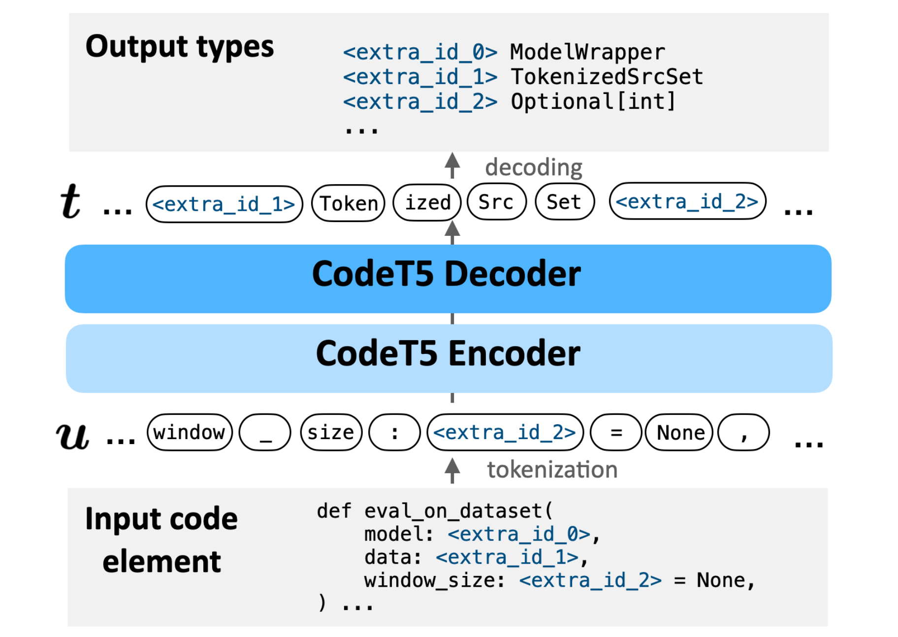

# TypeT5: Seq2seq Type Inference using Static Analysis



This repo contains the source code for the paper [TypeT5: Seq2seq Type Inference using Static Analysis](https://openreview.net/forum?id=4TyNEhI2GdN&noteId=EX_-kP9xah).

```
@inproceedings{Wei2023TypeT5,
    title={TypeT5: Seq2seq Type Inference using Static Analysis},
    author={Jiayi Wei and Greg Durrett and Isil Dillig},
    booktitle={International Conference on Learning Representations},
    year={2023},
    url={https://openreview.net/forum?id=4TyNEhI2GdN}
}
```

## Installation

This project uses [pipenv](https://pipenv.pypa.io/en/latest/) to manage the package dependencies. Pipenv tracks the exact package versions and manages the (project-specific) virtual environment for you. To install all dependencies, make sure you have pipenv and Python 3.10 installed, then, at the project root, run the following two commands:
```bash
pipenv --python <path-to-your-python-3.10>  # create a new environment for this project
pipenv sync --dev # install all specificed dependencies
```

More about pipenv:
- To add new dependences into the virtual environment, you can either add them via `pipenv install ..` (using `pipenv`) or `pipenv run pip install ..` (using `pip` from within the virtual environment).
- If your pytorch installation is not working properly, you might need to reinstall it via the `pipenv run pip install` approach rather than `pipenv install`.
- All `.py` scripts below can be run via `pipenv run python <script-name.py>`. For `.ipynb` notebooks, make sure you select the pipenv environment as the kernel. You can run all unit tests by running `pipenv run pytest` at the project root.

If you are not using pipenv:
- Make sure to add the environment variables in the [.env](.env) file to your shell environment when you run the scripts (needed by the parsing library).
- We also provided a [requirements.txt](requirements.txt) file for you to install the dependencies via `pip install -r requirements.txt`.


## Using the trained model
The notebook [scripts/run_typet5.ipynb](scripts/run_typet5.ipynb) shows you how to download the TypeT5 model from Huggingface and then use it to make type predictions for a specified codebase.

## Training a New Model

- First, run the notebook [scripts/collect_dataset.ipynb](scripts/collect_dataset.ipynb) to download and split the BetterTypes4Py dataset used in our paper.
    - The exact list of repos we used for the experiments in paper can be loaded from `data/repos_split.pkl` using `pickle.load`.
- Then, run [scripts/train_model.py](scripts/train_model.py) to train a new TypeT5 model. Training takes about 11 hours on a single Quadro RTX 8000 GPU with 48GB memory.


## Development
- Formatter: We use `black` for formatting with the default options.
- Type Checker: We use Pylance to type check this codebase. It's the built-in type checker shipped with the VSCode Python extension and can be enabled by setting `Python > Anlaysis > Type Checking Mode` to `basic`.
